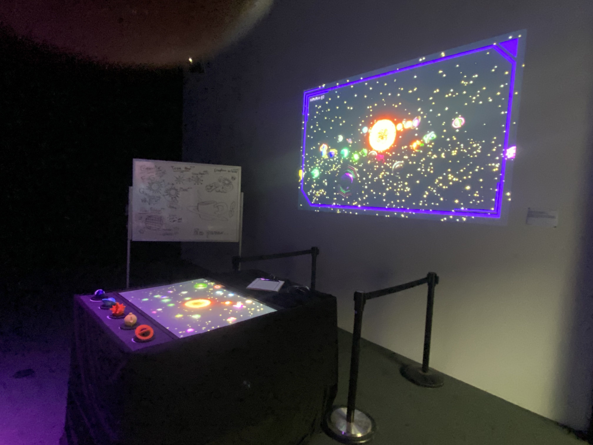

# Journal de création

## Semaine 9

## Semaine 8

## Semaine 7
Les statuettes ont été reçu, le projet a été optimisé et la table a été sécurisée, la scène a également été complétée, Nous sommes maintenant prêt pour l'exposition.

## Semaine 6
Nous avons enfin reçu les extensions de notre table, nous avons également pu poser le tissu par dessus celle-ci. La semaine prochaine va se concentrer sur les étapes finales du projet, donc la vidéo de présentation et les retouches finales du projet.

## Semaine 5
Cette semaine à été beaucoup plus calme que les deux dernières, ce qui est grandement apprécié, elle a tout de même commencé très lourdement, car c'est Lundi que nous avons reçu notre table, celle-ci portant certains... défauts de fabriquation qu'il va falloir vivre avec.

 
Pendant la majorité de la semaine, nous avons amélioré ce que nous avions déjà plutôt que créer de nouvelles choses. La raison étant que tout ce que nous voulons dans le jeu est présent, ne nous laissant qu'à améliorer ce que nous avons. La semaine prochaine, nous allons surtout nous concentrer sur l'espace physique du studio, ajouter de l'éclairage, améliorer notre décor, etc. De plus, nous avons enfin quelque chose de plus ou moins stable pour tenir notre kinect.

 
Nous avons également obtenu un tableau blanc.

## Semaine 4
Cette semaine n'a pas été de tout repos, la maquette de la table est terminée, notre démo à été finalisée, et contient maintenant toutes les fonctionnalitées qui seront présentes dans la version finale, tout ce qui nous reste vraiment à faire, c'est rajouter par dessus ce que nous avons, de nouvelles features ne seronts plus créées à partir de maintenant. Nous devrions recevoir la table lundi ou mardi, ce qu'il nous reste à accomplir est très clair et nous allons être capable de faire ce que nous avons à faire. Nos choses sont maintenant au plafond, et la table est maintenant plus facile à calibrer.

## Semaine 3
Cette semaine a été un très grand bond dans la progression de notre projet, avec un premier prototype fonctionnel de la table elle-même, une démo jouable de notre produit final avec quelques effets manquants. Au courant de la semaine, nous avons effectué plusieurs tests par rapport à la table, pour commencer, le projecteur n'est plus retenu à une élévation de 14", à la place, celui-ci sera sur le sol, en inclinaison, il tiens présentement sur une pile de boîtes de pommes, ce qui n'est définitivement pas ce que nous ferons pour la version finale. Nous avons également commencé à monter notre matériel au plafond, mais nous avons encontré quelque problèmes par rapport à cela donc il faudra en finir au courant de la semaine prochaine.

### Démo
Nous avons créé une démo jouable de notre produit final, celle-ci n'utilisait pas la version finale des effets visuels et modèls 3D et n'avais pas réelement d'audio, mais elle était jouable en faisant scanner à une webcam les marqueurs. Depuis, celle-ci est en train d'être adaptée pour être utilisée sur la table elle-même, mais cette conversion est toujours en cours. La démo ne contenait que les effets de trou noir et trou blanc, mais depuis la production de celle-ci, le reste des effets ont été développés.

### La table
Nous avons monté le prototype de la table pour la dernière fois (On espère). Guillaume nous a donné des plaques d'acrylique plus épaisses que ce que nous avions (1/4 de pouce contre 1/8 de pouce), ce qui donne plus d'intégrité au centre de la table. De plus, la caméra que nous risquons utiliser pour le projet sera une kinect V2, plus de détails à propos de cela dans le journal de Jacob. À cause de ce changement de caméra, nous risquons de remplacer le PI avec un micro ordinateur, car nous allons avoir besoin d'utiliser touchDesigner directement dans la table.

### La semaine prochaine...
La semaine prochaine ne va pas être de tout repos, il faut s'assurer de calibrer notre table. Avoir tout les effets programmés pour lundi prochain avec une démo complète, et avoir l'audio pour chacun des événements, rien ne doit nécéssairement être final, mais il faut que quelque chose sois présent. Car il faudra présenter la maquette du projet le 19.

## Semaine 2
Cette semaine a commencé d'une manière très mouvementée, Guillaume nous a annoncé qu'on devrait changer de logiciel pour le tracking de nos fiducials alors que nous avions déjà commencé à faire communiquer nos logiciels ensemble. Après plusieurs essais, nous sommes arrivé sur touch designer, nous avons maintenant du tracking dans le logiciel, mais également un petit problème: personne dans l'équipe n'est familier avec le Python, donc il faudra apprendre.

### La table
Nous avons déterminé que la table utiliserai un projecteur ultra short-throw, **celui-ci devant être élevé de 14"**, ce qui fait en sorte qu'il dépasse la table, il faudra donc déterminer une façon d'éviter que le projecteur brise l'immersion. Pendant que le côté pratique et technique de la table prend son temps, le côté artistique du projet progresse très bien, nous avons maintenant un style visuel qui est consistant parmis nos plusieurs éléments visuels, le côté jeu vidéo de la table est également en train de très bien progresser.

 

### En résumé
Notre projet a grandement progressé cette semaine, nous avons fait un pas à reculons pour deux en avant, le script présent dans touchDesigner est maintenant plus ou moins complètement fonctionnel, il ne reste qu'à calibrer le code avec la table, en d'autre lieu, nous n'avons toujours pas de caméra infrarouge, ce qui serait quelque-chose qui serait grandement aprécié d'obtenir au plus tôt possible. La semaine prochaine, il sera temps de commencer à monter notre scène finale dans unity.

## Semaine 1
Cette semaine, nous avons fait une grosse réunion d'équipe pour clarifier quelques points de notre projet.

Nous avons également fait les tests qui manquaient à faire, c'est-à-dire le test de l'apparition de l'image sur papier calque si un projecteur est présent derrière elle, aisni que la caméra infra-roughe pour détecter les fiducials présents sur les statuettes au travers du papier calque, nous pouvons maintenant réelement commencer à travailler sur notre projet.

### Détails du projet
Au cours de la semaine, nous avons solidifié nos idées sur le projet, beaucoup de ces choses peuvent être vus dans la préproduction, ici nous allons aller plus en détail sur le ce qu'il se passe sur la table. Sur celle-ci, on peut observer un un système solaire entouré de plusieurs choses: d'autres planettes, des lunes et des astéroïdes. Cet arrangement est un bac à sable dans lequel l'intéracteur peut causer plusieurs effets en posant les statuettes sur la table. Il y a 5 statuettes: 
- Trou noir
- Trou blanc (un jour ce nom va changer)
- Éruption Solaire
- Champ Magnétique
- Second Soleil
 
Les effets des statues sont celles-ci:

#### Trou Noir
**Type**: Déplacement
 
**Description**: Le trou noir déplace les objets vers son centre, lorsqu'ils arrivent à cet endroit, ils sont détruits, par contre, si on retire le trou noir avant que les objets arrivent au centre, ils conservent leurs momentum, ce qui peut causer des scénarios intéressants, comme par exemple, envoyer un astéroïde quelque-part dans le système. Lorsqu'on tourne cette statuette, l'effet est soit augmenté où réduit.

#### Trou Blanc
**Type**: Déplacement
 
**Description**: Le trou blanc, comme son nom l'indique, est le contraire du trou noir, fidèle à cette idée, déposer cette statue va repousser les éléments près du point où la statue est posée. Cela peut créer énormément de conséquences qui n'avaient pas étée prévues si la taille de la zone repoussant les objets est sous-estimée. Faire tourner la statuette augmente la taille de la zone repoussant les éléments, avec une limite bien sûr.

#### Éruption Solaire
**Type**: Destruction
 
**Description**: L'éruption solaire est très simple, lorsqu'on pose la statue sur la table, un rayon va partir du soleil jusqu'à la statue, détruisant tout ce qui se trouve entre les deux points, cette statue ne permet pas beaucoup de surprises, sauf la première fois où quelqu'un l'essai, mais aucun bac-à-sable n'est complet sans un outil de destruction massive. Comme la statue ne sert que d'un point pour la fin d'un segment, nous n'avons pas encore eu d'idée pour l'effet arrivant lorsqu'on tourne la statuette.

#### Champ Magnétique
**Type**: Chaos
 
**Description**: Le champ magnétique crée une zone autours de l'endroit où la statue à été posée, dans cette zone, les objets en orbite vont commencer à avoir des réactions étranges, par exemple, elles pourraient commencer à changer la direction vers laquelle elles vont. Où bien commencer à secouer violement. Les effets sont aléatoires et peuvent avoir différents résultats, lorsque la statue est tournée, les effets sont intensifiées.

#### Second Soleil
**Type**: Déplacement Chaotique
 
**Description**: Le second soleil agis comme celui au centre de la table, les planettes font donc commencer à orbiter autours de celui-ci si elles s'approchent trop de son champ d'attraction, certaines intéractions sont également possible avec les autres statutes, par exemple, l'éruption solaire va également être lancée à partir du second soleil. Faire tourner la statue augmente ou réduit l'effet.

