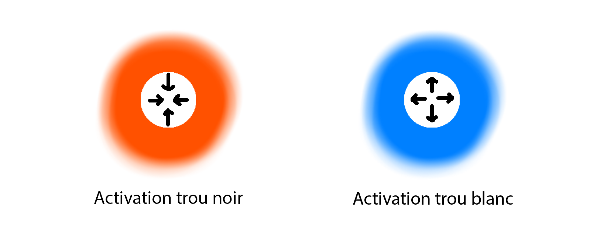
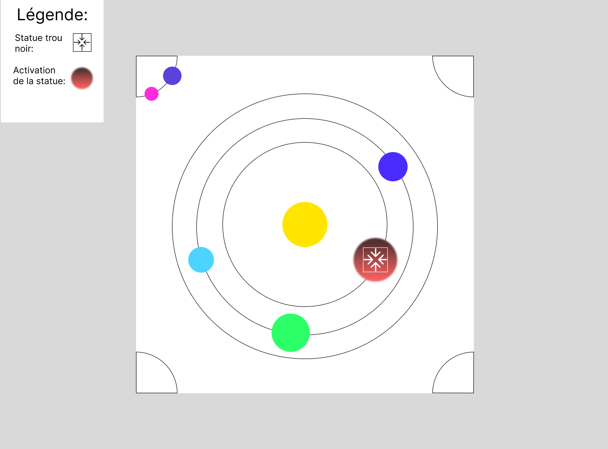
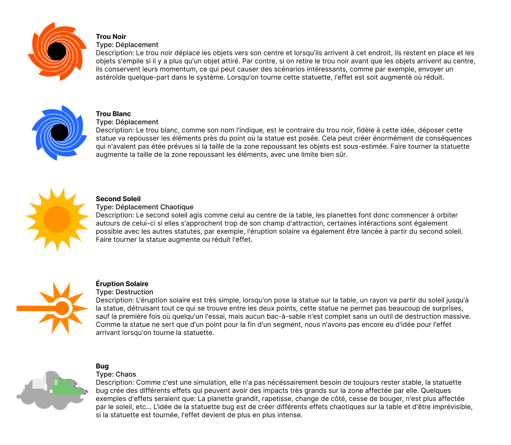

# Journal de Jérémy Cholette

* [Semaine 1](#semaine-1)
* [Semaine 2](#semaine-2)
* [Semaine 3](#semaine-3)
* [Semaine 4](#semaine-4)
* [Semaine 5](#semaine-5)
* [Semaine de rattrapage](#semaine-de-rattrapage)
* [Semaine 6](#semaine-6)
* [Semaine 7](#semaine-7)
* [Semaine 8](#semaine-8)
* [Semaine 9](#semaine-9)

## Semaine 1

### Résumé des réalisations effectuées
- J'ai réalisé des schémas des activations visuelles des statues. Lorsqu'une statue est posée sur la table, une zone colorée va entourer la base de la statue pour montrer à l'utilisateur que la statue a bel et bien été activé. J'ai aussi refait le schéma de plantation de la préproduction. De plus, j'ai effectuer des tests avec Jacob pour voir si la caméra pouvait détecter nos statuette à travers les deux plaques d'acryliques et la feuille de papier calque.  

### Image d'une réalisation dont tu es la ou le plus fier

ou

### Est-ce que j'ai accompli l'ensemble des tâches et objectifs que je m'étais fixés pour cette semaine?	
- [X] Complètement
- [ ] Assez
- [ ] Peu
- [ ] Pas du tout

#### Décrivez pourquoi.
Nous avons retravaillé notre travail pou qu'il soit plus cohérent et cela nous a donc permis de trouver plus d'idées au niveau visuel de notre installation.

### Mon projet s'est-il réalisé selon l’échéancier prévu?

- [X] Complètement
- [ ] Assez
- [ ] Un peu
- [ ] Pas tout à fait

### Défis pour la prochaine semaine
Pour la semaine prochaine, j'aimerais faire des tests sonores et composer quelques échantillons sonores pour les sons d'activations et d'ambiance.

---
## Semaine 2
### Résumé des réalisations effectuées
Cette semaine j'ai refait le scénarimage et créer une légende avec des icones et une description de ce que chaque statuettes fait. J'ai également créer des prototypes sonores de la musique d'ambiance et de quelques sons. J'ai aussi aider à effectuer des tests pour calculer la distance à laquelle nous devrions mettre le projecteur par rapport à la plaque d'acrylique.

### Image d'une réalisation dont tu es la ou le plus fier

Légende des effets des statuettes

### Est-ce que j'ai accompli l'ensemble des tâches et objectifs que je m'étais fixés pour cette semaine?

- [X] Complètement
- [ ] Assez
- [ ] Peu
- [ ] Pas du tout

#### Décrivez pourquoi.
 Cette semaine je m'étais fixé comme objectif de réalisé des prototypes sonores et faire des tests avec le projecteur mais j'ai également refait le scénarimage en plus d'une légende détaillé des effets de chaque statues.

#### S'il y a lieu, qu'allez-vous faire pour remédier à la situation?

### Mon projet s'est-il réalisé selon l’échéancier prévu?

- [X] Complètement
- [ ] Assez
- [ ] Un peu
- [ ] Pas tout à fait

### Défis pour la prochaine semaine
La semaine prochaine j'aimerais continuer à aider à effectuer des tests avec la caméra infrarouge et commencer à travailler sur les sons finals du projet.

---
## Semaine 3 
### Résumé des réalisations effectuées
Cette semaine j'ai effectuer des tests avec le projecteur sous les plaques d'acrylique, aider à l'installation de matériel au plafond, fait le tableau des sons qui serait présent sur le projet et de nouveau prototype sonore.

### Image d'une réalisation dont tu es la ou le plus fier

### Est-ce que j'ai accompli l'ensemble des tâches et objectifs que je m'étais fixés pour cette semaine?

- [x] Complètement
- [ ] Assez
- [ ] Peu
- [ ] Pas du tout

#### Décrivez pourquoi.
 Cette semaine j'avais pour objectif de refaire des prototypes sonore et le tableau des sons en plus de l'installation du matériel au plafond.

### Mon projet s'est-il réalisé selon l’échéancier prévu?

- [x] Complètement
- [ ] Assez
- [ ] Un peu
- [ ] Pas tout à fait

### Défis pour la prochaine semaine
La semaine prochaine j'aimerais commencer les sons qui seront presque finaux et faire des musiques d'ambiance pour le projet. J'aimerais aussi terminer d'installer les équipements au plafond et finaliser notre prototype. Je vais aussi migrer les sons sur unity.

---
## Semaine 4
### Résumé des réalisations effectuées

### Image d'une réalisation dont tu es la ou le plus fier

### Est-ce que j'ai accompli l'ensemble des tâches et objectifs que je m'étais fixés pour cette semaine?

- [ ] Complètement
- [ ] Assez
- [ ] Peu
- [ ] Pas du tout

#### Décrivez pourquoi.
 

#### S'il y a lieu, qu'allez-vous faire pour remédier à la situation?

### Mon projet s'est-il réalisé selon l’échéancier prévu?

- [ ] Complètement
- [ ] Assez
- [ ] Un peu
- [ ] Pas tout à fait

#### S'il y a des écarts, décrivez-les.

#### S'il y a lieu, qu'allez-vous faire pour remédier à la situation?

### Défis pour la prochaine semaine

---
## Semaine 5
### Résumé des réalisations effectuées

### Image d'une réalisation dont tu es la ou le plus fier

### Est-ce que j'ai accompli l'ensemble des tâches et objectifs que je m'étais fixés pour cette semaine?

- [ ] Complètement
- [ ] Assez
- [ ] Peu
- [ ] Pas du tout

#### Décrivez pourquoi.
 

#### S'il y a lieu, qu'allez-vous faire pour remédier à la situation?

### Mon projet s'est-il réalisé selon l’échéancier prévu?

- [ ] Complètement
- [ ] Assez
- [ ] Un peu
- [ ] Pas tout à fait

#### S'il y a des écarts, décrivez-les.

#### S'il y a lieu, qu'allez-vous faire pour remédier à la situation?

### Défis pour la prochaine semaine

---
## Semaine de rattrapage
### Résumé des réalisations effectuées

### Image d'une réalisation dont tu es la ou le plus fier

### Est-ce que j'ai accompli l'ensemble des tâches et objectifs que je m'étais fixés pour cette semaine?

- [ ] Complètement
- [ ] Assez
- [ ] Peu
- [ ] Pas du tout

#### Décrivez pourquoi.
 

#### S'il y a lieu, qu'allez-vous faire pour remédier à la situation?

### Mon projet s'est-il réalisé selon l’échéancier prévu?

- [ ] Complètement
- [ ] Assez
- [ ] Un peu
- [ ] Pas tout à fait

#### S'il y a des écarts, décrivez-les.

#### S'il y a lieu, qu'allez-vous faire pour remédier à la situation?

### Défis pour la prochaine semaine

---
## Semaine 6
### Résumé des réalisations effectuées

### Image d'une réalisation dont tu es la ou le plus fier

### Est-ce que j'ai accompli l'ensemble des tâches et objectifs que je m'étais fixés pour cette semaine?

- [ ] Complètement
- [ ] Assez
- [ ] Peu
- [ ] Pas du tout

#### Décrivez pourquoi.
 

#### S'il y a lieu, qu'allez-vous faire pour remédier à la situation?

### Mon projet s'est-il réalisé selon l’échéancier prévu?

- [ ] Complètement
- [ ] Assez
- [ ] Un peu
- [ ] Pas tout à fait

#### S'il y a des écarts, décrivez-les.

#### S'il y a lieu, qu'allez-vous faire pour remédier à la situation?

### Défis pour la prochaine semaine

---
## Semaine 7
### Résumé des réalisations effectuées

### Image d'une réalisation dont tu es la ou le plus fier

### Est-ce que j'ai accompli l'ensemble des tâches et objectifs que je m'étais fixés pour cette semaine?

- [ ] Complètement
- [ ] Assez
- [ ] Peu
- [ ] Pas du tout

#### Décrivez pourquoi.
 

#### S'il y a lieu, qu'allez-vous faire pour remédier à la situation?

### Mon projet s'est-il réalisé selon l’échéancier prévu?

- [ ] Complètement
- [ ] Assez
- [ ] Un peu
- [ ] Pas tout à fait

#### S'il y a des écarts, décrivez-les.

#### S'il y a lieu, qu'allez-vous faire pour remédier à la situation?

### Défis pour la prochaine semaine

## Semaine 8

## Semaine 9
