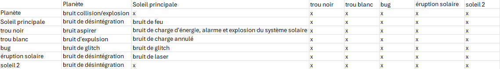
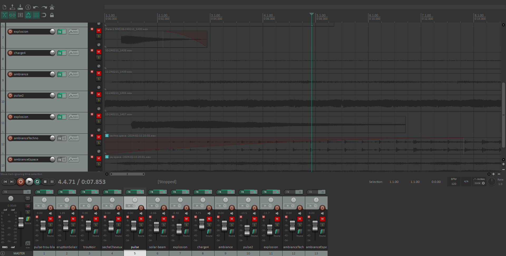
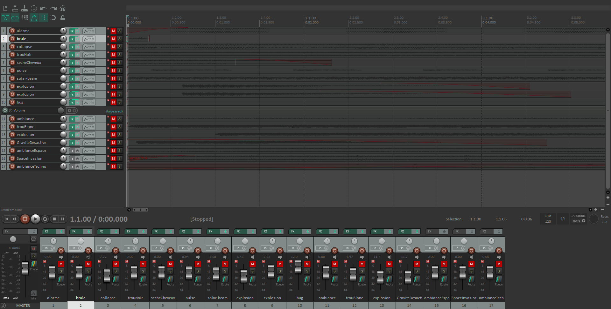
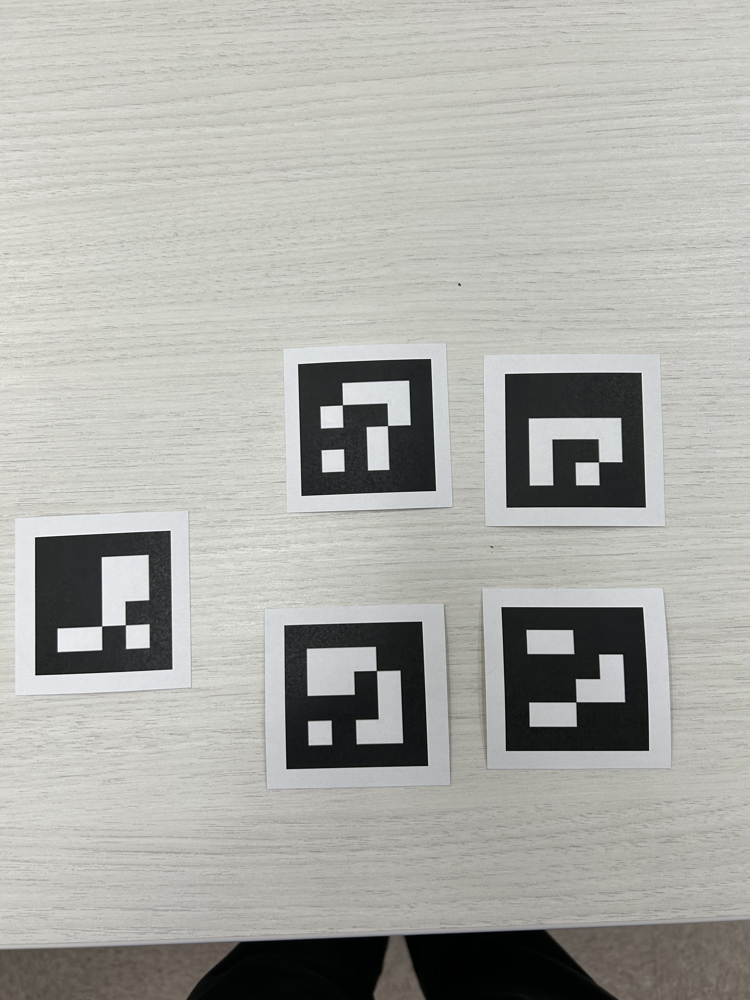

# Journal de Jérémy Cholette

* [Semaine 1](#semaine-1)
* [Semaine 2](#semaine-2)
* [Semaine 3](#semaine-3)
* [Semaine 4](#semaine-4)
* [Semaine 5](#semaine-5)
* [Semaine de rattrapage](#semaine-de-rattrapage)
* [Semaine 6](#semaine-6)
* [Semaine 7](#semaine-7)
* [Semaine 8](#semaine-8)
* [Semaine 9](#semaine-9)

## Semaine 1

### Résumé des réalisations effectuées
- J'ai réalisé des schémas des activations visuelles des statues. Lorsqu'une statue est posée sur la table, une zone colorée va entourer la base de la statue pour montrer à l'utilisateur que la statue a bel et bien été activé. J'ai aussi refait le schéma de plantation de la préproduction. De plus, j'ai effectuer des tests avec Jacob pour voir si la caméra pouvait détecter nos statuette à travers les deux plaques d'acryliques et la feuille de papier calque.  

### Image d'une réalisation dont tu es la ou le plus fier

ou

### Est-ce que j'ai accompli l'ensemble des tâches et objectifs que je m'étais fixés pour cette semaine?	
- [X] Complètement
- [ ] Assez
- [ ] Peu
- [ ] Pas du tout

#### Décrivez pourquoi.
Nous avons retravaillé notre travail pou qu'il soit plus cohérent et cela nous a donc permis de trouver plus d'idées au niveau visuel de notre installation.

### Mon projet s'est-il réalisé selon l’échéancier prévu?

- [X] Complètement
- [ ] Assez
- [ ] Un peu
- [ ] Pas tout à fait

### Défis pour la prochaine semaine
Pour la semaine prochaine, j'aimerais faire des tests sonores et composer quelques échantillons sonores pour les sons d'activations et d'ambiance.

---
## Semaine 2
### Résumé des réalisations effectuées
Cette semaine j'ai refait le scénarimage et créer une légende avec des icones et une description de ce que chaque statuettes fait. J'ai également créer des prototypes sonores de la musique d'ambiance et de quelques sons. J'ai aussi aider à effectuer des tests pour calculer la distance à laquelle nous devrions mettre le projecteur par rapport à la plaque d'acrylique.

### Image d'une réalisation dont tu es la ou le plus fier

Légende des effets des statuettes

### Est-ce que j'ai accompli l'ensemble des tâches et objectifs que je m'étais fixés pour cette semaine?

- [X] Complètement
- [ ] Assez
- [ ] Peu
- [ ] Pas du tout

#### Décrivez pourquoi.
 Cette semaine je m'étais fixé comme objectif de réalisé des prototypes sonores et faire des tests avec le projecteur mais j'ai également refait le scénarimage en plus d'une légende détaillé des effets de chaque statues.

#### S'il y a lieu, qu'allez-vous faire pour remédier à la situation?

### Mon projet s'est-il réalisé selon l’échéancier prévu?

- [X] Complètement
- [ ] Assez
- [ ] Un peu
- [ ] Pas tout à fait

### Défis pour la prochaine semaine
La semaine prochaine j'aimerais continuer à aider à effectuer des tests avec la caméra infrarouge et commencer à travailler sur les sons finals du projet.

---
## Semaine 3 
### Résumé des réalisations effectuées
Cette semaine j'ai effectuer des tests avec le projecteur sous les plaques d'acrylique, aider à l'installation de matériel au plafond, fait le tableau des sons qui serait présent sur le projet et de nouveau prototype sonore.

### Image d'une réalisation dont tu es la ou le plus fier

### Est-ce que j'ai accompli l'ensemble des tâches et objectifs que je m'étais fixés pour cette semaine?

- [x] Complètement
- [ ] Assez
- [ ] Peu
- [ ] Pas du tout

#### Décrivez pourquoi.
 Cette semaine j'avais pour objectif de refaire des prototypes sonore et le tableau des sons en plus de l'installation du matériel au plafond.

### Mon projet s'est-il réalisé selon l’échéancier prévu?

- [x] Complètement
- [ ] Assez
- [ ] Un peu
- [ ] Pas tout à fait

### Défis pour la prochaine semaine
La semaine prochaine j'aimerais commencer les sons qui seront presque finaux et faire des musiques d'ambiance pour le projet. J'aimerais aussi terminer d'installer les équipements au plafond et finaliser notre prototype. Je vais aussi migrer les sons sur unity.

---
## Semaine 4
### Résumé des réalisations effectuées
Cette semaine j'ai looper les sons et la musique d'ambiance et je les ai intégrés dans Unity. J'ai aidé à relier unity à TouchDesigner en spout pour pouvoir le mapper sur la table. J'ai également aidé à travailler sur la priorité des sons dans unity et leur volume. J'ai également créé quelques nouveaux effets sonore.

### Image d'une réalisation dont tu es la ou le plus fier

### Est-ce que j'ai accompli l'ensemble des tâches et objectifs que je m'étais fixés pour cette semaine?

- [X] Complètement
- [ ] Assez
- [ ] Peu
- [ ] Pas du tout

#### Décrivez pourquoi.
Cette semaine j'avais prévu de looper les sons qui avaient été accepter pour le projet et de travailler sur la communication entre unity et TouchDesigner pour le mapping de la projection dans la table. J'ai également aider Jacob dans ces tests pour l'explosion du soleil.

### Mon projet s'est-il réalisé selon l’échéancier prévu?

- [X] Complètement
- [ ] Assez
- [ ] Un peu
- [ ] Pas tout à fait

### Défis pour la prochaine semaine
Pour la semaine prochaine j'aimerais polir les sons que nous avons et également monter la table avec la structure finale.

---
## Semaine 5
### Résumé des réalisations effectuées
Cette semaine j'ai retravailler les loops de chaque sons ainsi que certain effet sur chacun des sons.Je leurs ai tous ajouter un eq pour éviter que les sons émettent un certain crunch. J'ai également retravailler le son du trou blanc au complet pour qu'il se distingue plus des autres sons et aussi créer trois nouveaux sons de "brûlure" pour lorsque les planètes sont troucher par l'éruption solaire ou le soleil. J'ai également monter la table et aider à replacer l'équipement dessous cette dernière pour que tout fonctionne optimalement. Dernièrement nous avons beaucoup fait de bug fixing suite au recontre avec les étudiants qui venaient tester les projets.

### Image d'une réalisation dont tu es la ou le plus fier

### Est-ce que j'ai accompli l'ensemble des tâches et objectifs que je m'étais fixés pour cette semaine?

- [X] Complètement
- [ ] Assez
- [ ] Peu
- [ ] Pas du tout

#### Décrivez pourquoi.
Cette semaine je m'étais fixer comme tâches d'apporter des modifications aux sons suite au feedback reçu sur les sons et également en créer de nouveaux pour certains éléments qui n'avaient pas encore de sons. J'ai pu monter la table en plus et pu aider à la calibrer et la préparer à être dans son setup final. J'ai pu aussi aider à faire du bugfix grâce au visite des étudiants. J'ai donc accompli tout ce que je m'étais fixer pour cette semaine. 

### Mon projet s'est-il réalisé selon l’échéancier prévu?

- [X] Complètement
- [ ] Assez
- [ ] Un peu
- [ ] Pas tout à fait

### Défis pour la prochaine semaine
Pour la semaine prochaine je compte continuer à aider à faire du bug fixing ainsi que créer les assets sonores manquant au projet et également retravailler mes sons si nécessaire. Je compte aussi aider à préparer le décor de notre installation ainsi que monter les extensions de la table pour cacher les éléments présent sous cette dernière.

---
## Semaine 6
### Résumé des réalisations effectuées
Cette semaine j'ai créer de nouveaux sons lorsque les différentes statues interagissent avec le soleil ainsi que des sons d'explosion, de collision et de désintégration pour les planètes. J'ai également fait imprimer les autocollants qui vont aller sous les statuettes pour la détection. J'ai commencer à exporter les sons finaux avec leurs loops et leurs niveaux normaliser.

### Image d'une réalisation dont tu es la ou le plus fier

### Est-ce que j'ai accompli l'ensemble des tâches et objectifs que je m'étais fixés pour cette semaine?

- [ ] Complètement
- [X] Assez
- [ ] Peu
- [ ] Pas du tout

#### Décrivez pourquoi.
 Cette semaine j'ai pu créer de nouveaux sons pour les éléments qui interagissent avec le soleil mais je n'ai pas eu le temps de tout normaliser et looper ceux qui le necessitait.

### Mon projet s'est-il réalisé selon l’échéancier prévu?

- [X] Complètement
- [ ] Assez
- [ ] Un peu
- [ ] Pas tout à fait

### Défis pour la prochaine semaine
Durant la semaine de rattrapage je compte terminer les sons sur lesquelles je travaillais et tous les exporter avec leur loop ainsi que le niveau normaliser.

---
## Semaine de rattrapage
### Résumé des réalisations effectuées

### Image d'une réalisation dont tu es la ou le plus fier

### Est-ce que j'ai accompli l'ensemble des tâches et objectifs que je m'étais fixés pour cette semaine?

- [ ] Complètement
- [ ] Assez
- [ ] Peu
- [ ] Pas du tout

#### Décrivez pourquoi.
 

#### S'il y a lieu, qu'allez-vous faire pour remédier à la situation?

### Mon projet s'est-il réalisé selon l’échéancier prévu?

- [ ] Complètement
- [ ] Assez
- [ ] Un peu
- [ ] Pas tout à fait

#### S'il y a des écarts, décrivez-les.

#### S'il y a lieu, qu'allez-vous faire pour remédier à la situation?

### Défis pour la prochaine semaine

---
## Semaine 7
### Résumé des réalisations effectuées

### Image d'une réalisation dont tu es la ou le plus fier

### Est-ce que j'ai accompli l'ensemble des tâches et objectifs que je m'étais fixés pour cette semaine?

- [ ] Complètement
- [ ] Assez
- [ ] Peu
- [ ] Pas du tout

#### Décrivez pourquoi.
 

#### S'il y a lieu, qu'allez-vous faire pour remédier à la situation?

### Mon projet s'est-il réalisé selon l’échéancier prévu?

- [ ] Complètement
- [ ] Assez
- [ ] Un peu
- [ ] Pas tout à fait

#### S'il y a des écarts, décrivez-les.

#### S'il y a lieu, qu'allez-vous faire pour remédier à la situation?

### Défis pour la prochaine semaine

## Semaine 8

## Semaine 9
