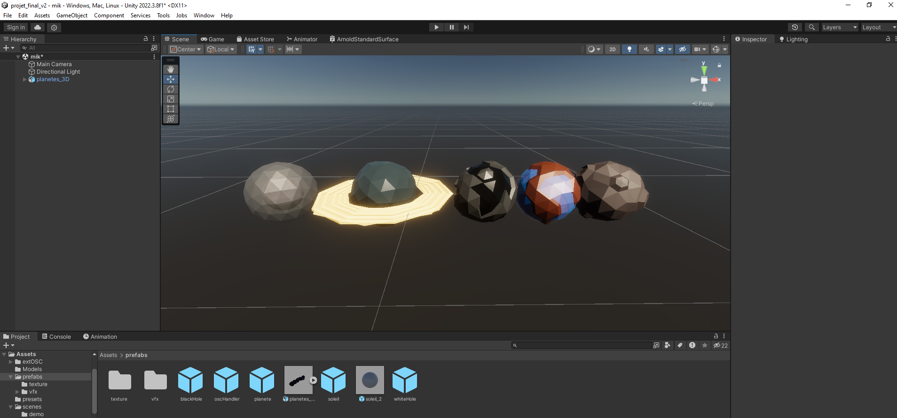
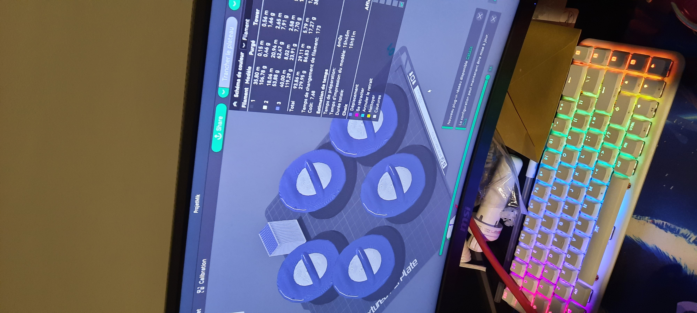

# Journal de Mikaël Tourangeau

* [Semaine 1](#semaine-1)
* [Semaine 2](#semaine-2)
* [Semaine 3](#semaine-3)
* [Semaine 4](#semaine-4)
* [Semaine 5](#semaine-5)
* [Semaine 6](#semaine-6)
* [Semaine de rattrapage](#semaine-de-rattrapage)
* [Semaine 7](#semaine-7)
* [Semaine 8](#semaine-8)
* [Semaine 9](#semaine-9)

## Semaine 1

### Résumé des réalisations effectuées
- Début de la conception des statuettes
### Image d'une réalisation dont tu es la ou le plus fier

### Est-ce que j'ai accompli l'ensemble des tâches et objectifs que je m'étais fixés pour cette semaine?	
- [ ] Complètement
- [x] Assez
- [ ] Peu
- [ ] Pas du tout

#### Décrivez pourquoi.
Parce que les statuettes sont déjà fini pour le concept de base en uniquement 2 jours.

#### S'il y a lieu, qu'allez-vous faire pour remédier à la situation?
N/A

### Mon projet s'est-il réalisé selon l’échéancier prévu?

- [ ] Complètement
- [x] Assez
- [ ] Un peu
- [ ] Pas tout à fait

#### S'il y a des écarts, décrivez-les.
N/A

#### S'il y a lieu, qu'allez-vous faire pour remédier à la situation?
N/A

### Défis pour la prochaine semaine
Réussir à faire des modèles adaptables à l'impression 3D.

---
## Semaine 2
### Résumé des réalisations effectuées

- Modification des statues et conception des planètes

### Image d'une réalisation dont tu es la ou le plus fier

### Est-ce que j'ai accompli l'ensemble des tâches et objectifs que je m'étais fixés pour cette semaine?

- [ ] Complètement
- [x] Assez
- [ ] Peu
- [ ] Pas du tout

#### Décrivez pourquoi.

Parce que les statuettes avancent bien et les planètes sont déjà fini en modélisation.

#### S'il y a lieu, qu'allez-vous faire pour remédier à la situation?

N/A

### Mon projet s'est-il réalisé selon l’échéancier prévu?

- [x] Complètement
- [ ] Assez
- [ ] Un peu
- [ ] Pas tout à fait

#### S'il y a des écarts, décrivez-les.

Problème de logiciel.

#### S'il y a lieu, qu'allez-vous faire pour remédier à la situation?

Régler le problème.

### Défis pour la prochaine semaine

Installer l'équipement au plafond.
---
## Semaine 3 
### Résumé des réalisations effectuées

- Planètes finies et intégré dans unity.

- Équipement installé au plafond.

### Image d'une réalisation dont tu es la ou le plus fier

### Est-ce que j'ai accompli l'ensemble des tâches et objectifs que je m'étais fixés pour cette semaine?

- [x] Complètement
- [ ] Assez
- [ ] Peu
- [ ] Pas du tout

#### Décrivez pourquoi.
 
L'équipement est installé au plafond, donc nous n'aurons plus besoin d'attendre pour L'équipement plus tard. De plus, les planètes sont prêtes à être utilisées.

#### S'il y a lieu, qu'allez-vous faire pour remédier à la situation?

N/A

### Mon projet s'est-il réalisé selon l’échéancier prévu?

- [x] Complètement
- [ ] Assez
- [ ] Un peu
- [ ] Pas tout à fait

#### S'il y a des écarts, décrivez-les.

Problèmes d'équipements.

#### S'il y a lieu, qu'allez-vous faire pour remédier à la situation?

S'assurer d'avoir tous les équipements pour les travaux de la journée.

### Défis pour la prochaine semaine
Matériaux random dans unity.
---
## Semaine 4
### Résumé des réalisations effectuées
- Amélioration statuettes

- creation de statuettes

### Image d'une réalisation dont tu es la ou le plus fier

### Est-ce que j'ai accompli l'ensemble des tâches et objectifs que je m'étais fixés pour cette semaine?

- [ ] Complètement
- [x] Assez
- [ ] Peu
- [ ] Pas du tout

#### Décrivez pourquoi.
Parce que les statuettes sont presque fini et je pourrai aider mes coéquipiers pour le reste du projet

#### S'il y a lieu, qu'allez-vous faire pour remédier à la situation?
N/A

### Mon projet s'est-il réalisé selon l’échéancier prévu?

- [x] Complètement
- [ ] Assez
- [ ] Un peu
- [ ] Pas tout à fait

#### S'il y a des écarts, décrivez-les.
N/A

#### S'il y a lieu, qu'allez-vous faire pour remédier à la situation?
N/A

### Défis pour la prochaine semaine

Réussir à fixer le projecteur au sol

---
## Semaine 5
### Résumé des réalisations effectuées

- projecteur boitier

### Image d'une réalisation dont tu es la ou le plus fier

### Est-ce que j'ai accompli l'ensemble des tâches et objectifs que je m'étais fixés pour cette semaine?

- [x] Complètement
- [ ] Assez
- [ ] Peu
- [ ] Pas du tout

#### Décrivez pourquoi.
Parce que j'ai réglé le problème du projecteur qui bougeait 

#### S'il y a lieu, qu'allez-vous faire pour remédier à la situation?
N/A

### Mon projet s'est-il réalisé selon l’échéancier prévu?

- [x] Complètement
- [ ] Assez
- [ ] Un peu
- [ ] Pas tout à fait

#### S'il y a des écarts, décrivez-les.
N/A

#### S'il y a lieu, qu'allez-vous faire pour remédier à la situation?

N/A
### Défis pour la prochaine semaine

Aucun pour l'instant.

---

## Semaine 6
### Résumé des réalisations effectuées

- Création de nouvelles planètes
### Image d'une réalisation dont tu es la ou le plus fier

### Est-ce que j'ai accompli l'ensemble des tâches et objectifs que je m'étais fixés pour cette semaine?

- [x] Complètement
- [ ] Assez
- [ ] Peu
- [ ] Pas du tout

#### Décrivez pourquoi.
 
J'ai créer des nouvelles planètes pour rajouter de la diversité a l'écran.
#### S'il y a lieu, qu'allez-vous faire pour remédier à la situation?

N/A
### Mon projet s'est-il réalisé selon l’échéancier prévu?

- [x] Complètement
- [ ] Assez
- [ ] Un peu
- [ ] Pas tout à fait

#### S'il y a des écarts, décrivez-les.

N/A
#### S'il y a lieu, qu'allez-vous faire pour remédier à la situation?

N/A
### Défis pour la prochaine semaine

rendre la table plus longue.

---

## Semaine de rattrapage
### Résumé des réalisations effectuées
- Création des extensions de tables.
- Finalisation des statuettes.
- Impression des statuettes.

### Image d'une réalisation dont tu es la ou le plus fier

### Est-ce que j'ai accompli l'ensemble des tâches et objectifs que je m'étais fixés pour cette semaine?

- [x] Complètement
- [ ] Assez
- [ ] Peu
- [ ] Pas du tout

#### Décrivez pourquoi.
Parce que maintenant nous pouvons mettre les statuettes à quelques pars qui ne estn'sont pas sur la projection et les statuettes fonctionnent sur la table.

#### S'il y a lieu, qu'allez-vous faire pour remédier à la situation?
N/A

### Mon projet s'est-il réalisé selon l’échéancier prévu?

- [x] Complètement
- [ ] Assez
- [ ] Un peu
- [ ] Pas tout à fait

#### S'il y a des écarts, décrivez-les.
N/A

#### S'il y a lieu, qu'allez-vous faire pour remédier à la situation?
N/A

### Défis pour la prochaine semaine

---

## Semaine 7
### Résumé des réalisations effectuées
-Impression fini

-Modification soleil et éruption.

### Image d'une réalisation dont tu es la ou le plus fier

### Est-ce que j'ai accompli l'ensemble des tâches et objectifs que je m'étais fixés pour cette semaine?

- [x] Complètement
- [ ] Assez
- [ ] Peu
- [ ] Pas du tout

#### Décrivez pourquoi.
 L'impression se passe bien et nous pouvons maintenant parfaitement utiliser notre oeuvre.

#### S'il y a lieu, qu'allez-vous faire pour remédier à la situation?
N/A

### Mon projet s'est-il réalisé selon l’échéancier prévu?

- [x] Complètement
- [ ] Assez
- [ ] Un peu
- [ ] Pas tout à fait

#### S'il y a des écarts, décrivez-les.
N/A

#### S'il y a lieu, qu'allez-vous faire pour remédier à la situation?

N/A

### Défis pour la prochaine semaine
La chaleur de notre projet quand il y a beaucoup de personnes.

## Semaine 8

## Semaine 9
