# Préproduction

# Table des matières
1. [Intention ou concept](#Intention-ou-concept)
    - [Cartographie](#Cartographie)
    - [Intention de départ](#Intention-de-départ)
    - [Synopsis](#Synopsis)
    - [Tableau d'ambiance (*moodboard*)](#Tableau-d'ambiance-(*moodboard*))
    - [Scénario, scénarimage ou document audio/visuel](#Scénario,-scénarimage-ou-document-audio/visuel)
2. [Contenu multimédia à intégrer](#Contenu-multimédia-à-intégrer)
    - [Inventaire du contenu multimédia](#Inventaire-du-contenu-multimédia)
    - [Univers artistique des éléments](#Univers-artistique-des-éléments-centraux)
3. [Planification technique d'un prototype (devis technique)](#Planification-technique-(devis-technique))
    - [Schémas ou plans techniques](#Schémas-ou-plans-techniques)
    - [Matériaux requis](#Matériaux-de-scénographie-requis)
    - [Équipements requis](#Équipements-requis)
    - [Logiciels requis](#Logiciels-requis)
    - [Ressources humaines requises](#Ressources-humaines-requises)
    - [Ressources spatiales requises (rangement et locaux)](#Ressources-spatiales-requises-(rangement-et-locaux))
    - [Contraintes techniques et potentiels problèmes de production](#Contraintes-techniques-et-potentiels-problèmes-de-production)
4. [Planification de la production d'un prototype (budget et étapes de réalisation)](#Planification-de-la-production-(budget-et-étapes-de-réalisation))
    - [Budget prévisionnel](#Budget-prévisionnel)
    - [Échéancier global](#Échéancier-global)
    - [Liste des tâches à réaliser](#Liste-des-tâches-à-réaliser)
    - [Rôles et responsabilités des membres de l'équipe](#Rôles-et-responsabilités-des-membres-de-l'équipe))
    - [Moments des rencontres d'équipe](#Moments-des-rencontres-d'équipe)

# Intention ou concept
## Cartographie

## Intention de départ
Donner le pouvoir à l'intéracteur de jouer avec un système solaire qui agit comme un bac à sable en utilisant divers outils.

## Synopsis
L'utilisateur interagit en déplaçant une statuette avec un fiducial, ceux-ci représentant les divers outils de manipulations disponible. Par exemple, on peux utiliser un trou noir pour bouger des planètes et/ou d'autres objets astronomiques et causer d'autres phénomènes astronomiques comme des éruptions solaires. Essentiellement, le système solaire est un bac à sable où on peux créer et démolir les planètes!

## Prémise du projet
L'intéracteur entre dans une salle contenant une table et quelques étranges statuettes, il aperçois sur la table un notepad, celui-ci contenant des détails sur des expériences qui ont été effectués avec la table, par le biais de ces notes, l'intéracteur apprend comment se servir de la table et il apprend également que l'individu en charge de celle-ci est présentement en pause, il ne devrait probablement pas toucher aux outils, mais il n'y a personne pour lui en empêcher...

## Tableau d'ambiance (*moodboard*)

## Scénario, scénarimage ou document audio/visuel

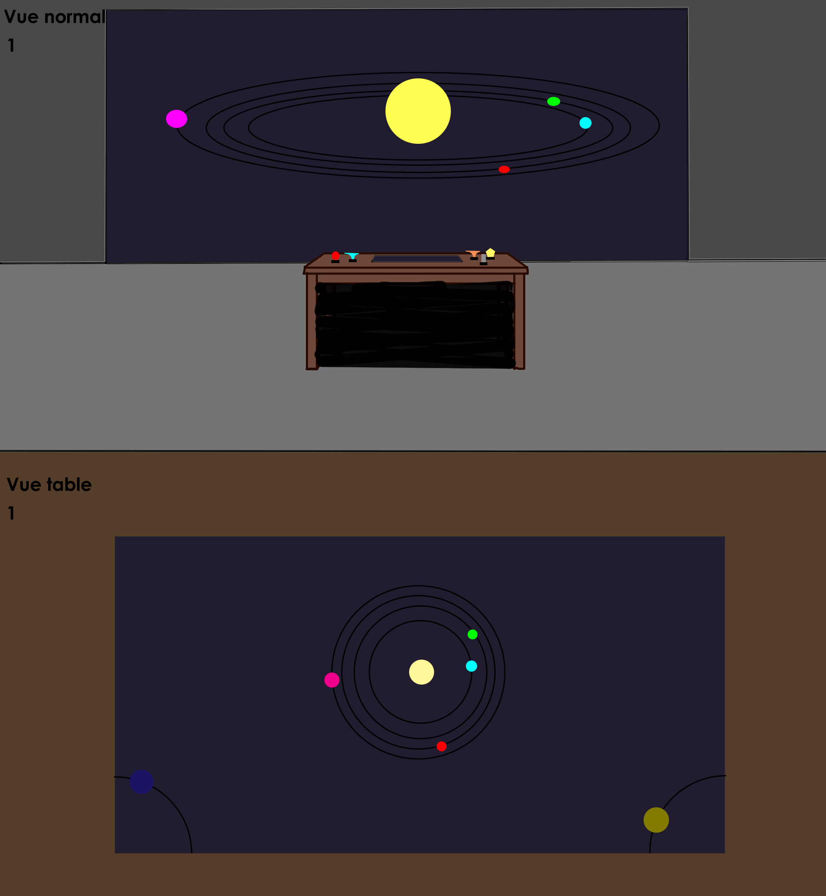

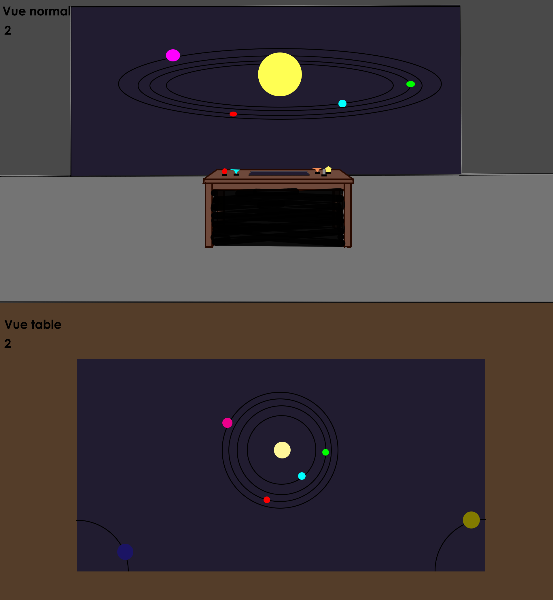

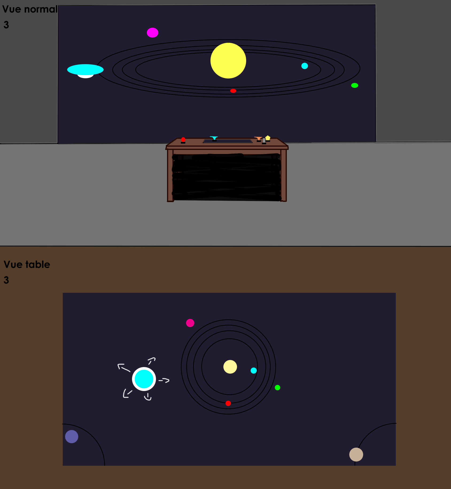

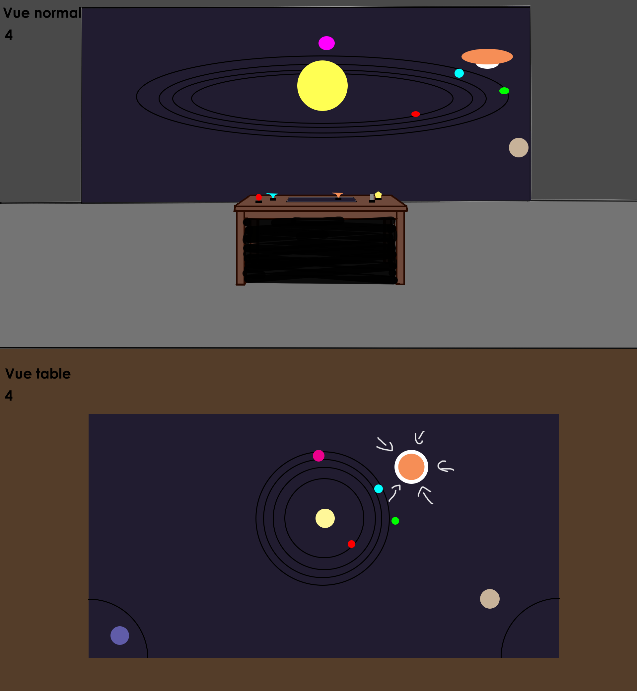

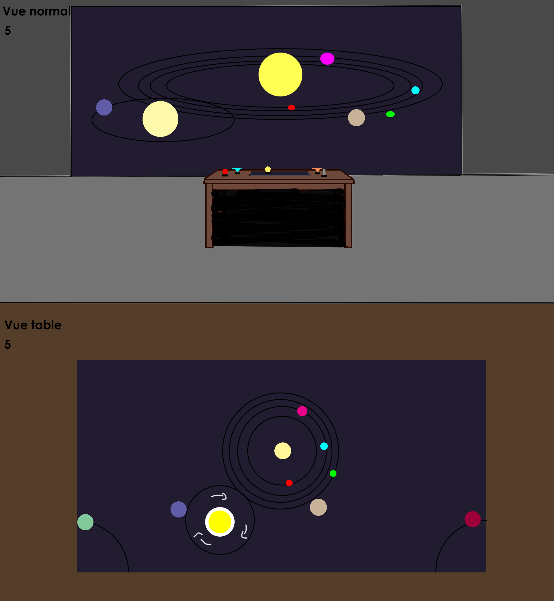

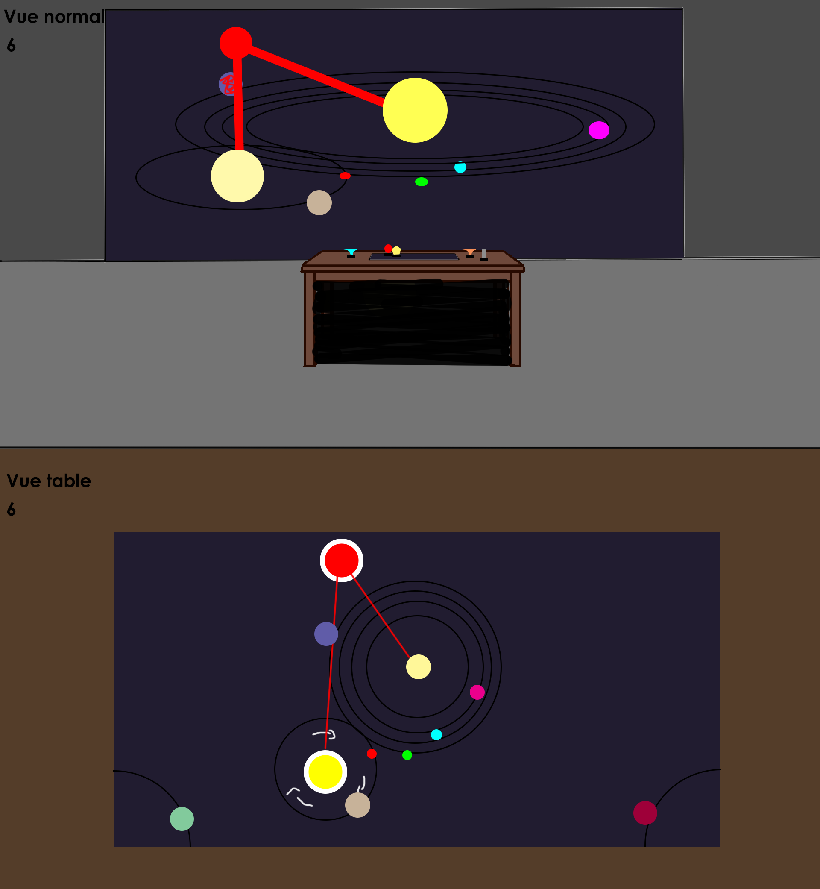

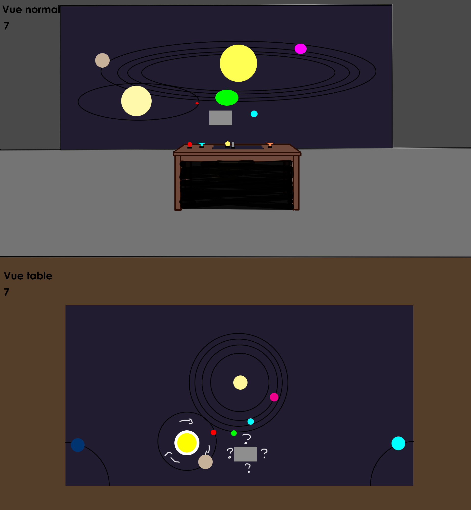

### Description des effets des statues

#### Trou Noir
**Type**: Déplacement
 
**Description**: Le trou noir déplace les objets vers son centre et lorsqu'ils arrivent à cet endroit, ils restent en place et les objets s'empile si il y a plus qu'un objet attiré. Par contre, si on retire le trou noir avant que les objets arrivent au centre, ils conservent leurs momentum, ce qui peut causer des scénarios intéressants, comme par exemple, envoyer un astéroïde quelque-part dans le système. Lorsqu'on tourne cette statuette, l'effet est soit augmenté où réduit.

#### Trou Blanc
**Type**: Déplacement
 
**Description**: Le trou blanc, comme son nom l'indique, est le contraire du trou noir, fidèle à cette idée, déposer cette statue va repousser les éléments près du point où la statue est posée. Cela peut créer énormément de conséquences qui n'avaient pas étée prévues si la taille de la zone repoussant les objets est sous-estimée. Faire tourner la statuette augmente la taille de la zone repoussant les éléments, avec une limite bien sûr.

#### Éruption Solaire
**Type**: Destruction
 
**Description**: L'éruption solaire est très simple, lorsqu'on pose la statue sur la table, un rayon va partir du soleil jusqu'à la statue, détruisant tout ce qui se trouve entre les deux points, cette statue ne permet pas beaucoup de surprises, sauf la première fois où quelqu'un l'essai, mais aucun bac-à-sable n'est complet sans un outil de destruction massive. Comme la statue ne sert que d'un point pour la fin d'un segment, nous n'avons pas encore eu d'idée pour l'effet arrivant lorsqu'on tourne la statuette.

#### Bug
**Type**: Chaos
 
**Description**: Comme c'est une simulation, elle n'a pas nécéssairement besoin de toujours rester stable, la statuette bug crée des différents effets qui peuvent avoir des impacts très grands sur la zone affectée par elle. Quelques exemples d'effets seraient que: La planette grandit, rapetisse, change de côté, cesse de bouger, n'est plus affectée par le soleil, etc... L'idée de la statuette bug est de créer différents effets chaotiques sur la table et d'être imprévisible, si la statuette est tournée, l'effet devient de plus en plus intense.

#### Second Soleil
**Type**: Déplacement Chaotique
 
**Description**: Le second soleil agis comme celui au centre de la table, les planettes font donc commencer à orbiter autours de celui-ci si elles s'approchent trop de son champ d'attraction, certaines intéractions sont également possible avec les autres statutes, par exemple, l'éruption solaire va également être lancée à partir du second soleil. Faire tourner la statue augmente ou réduit l'effet.

# Contenu multimédia à intégrer
## Inventaire du contenu multimédia

-  statuettes (pour les utilisateurs-trices)
-  sons
-  paysages sonores
-  vfx d'animation 3D
-  source lumineuse

## Univers artistique des éléments

Univers contemplatif d'éléments reliés à l'espace avec plusieurs formes et couleurs qui pourront se mélanger entre eux.

# Planification technique d'un prototype (devis technique)
## Schémas ou plans techniques

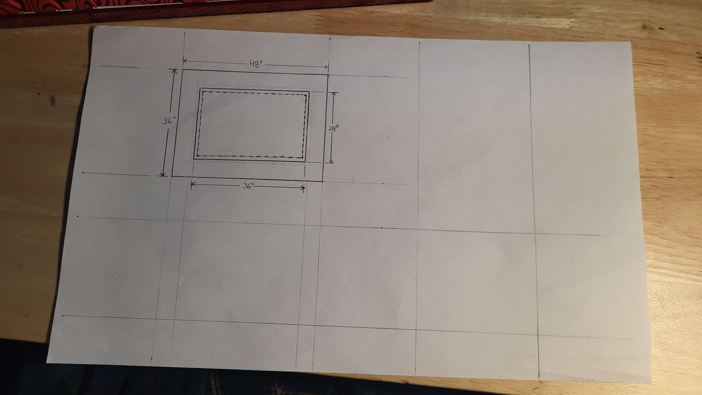
> Schéma de la table déssiné par notre soudeur

### Plantation 

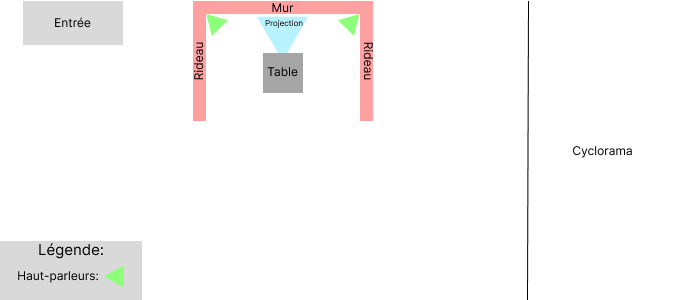
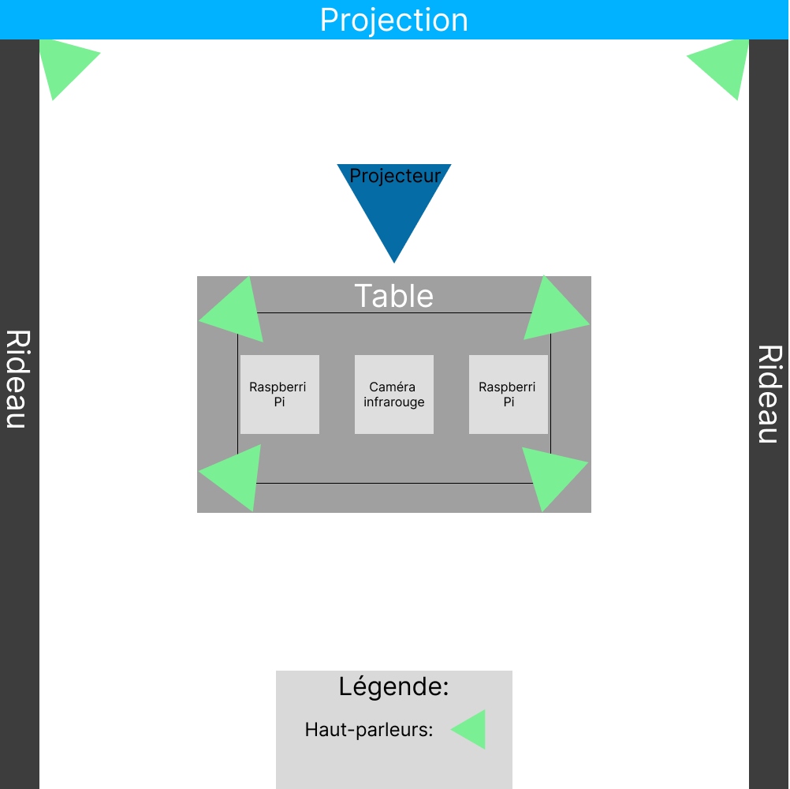

### Schéma de branchement 

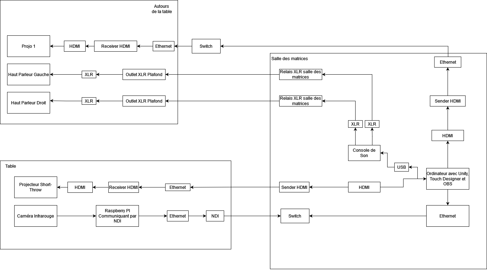

## Matériel de scénographie requis

* Table
    * Matériaux: Bois, Aluminium, Acrylique, Spandex
    * 48" x 36", 30" de hauteur
* Statuettes imprimées en 3D
* Notepad contenant les infos pour l'opération de la table.

## Équipements requis

* Audio
    * 2 haut-parleurs
    * 4 fils XLR 3 conducteurs de 15' (M->F)
    * 1 carte de son

* Vidéo
    * 2 projecteurs vidéo shortrow
    * 3 système d'acrochage
    * 1 caméra infrarouge

* Électricité
    * 2 cordon IEC (pour l'alimentation des haut-parleurs)
    * 2 multiprise

* Réseau
    * Switch poe 2 ports
    * 5 Cables Ethernet
    * 2 Cables HDMI
    * 2 Receivers HDMI
    * 2 Sender HDMI
    * 1 Capture card

* Ordinateur
    * 1 ordinateur

* micro ordinateur
    * 1 raspberry pi    
    

## Logiciels requis

* [Touch Designer](https://derivative.ca/)
* [Unity 2019 lts](https://unity.com/)
* [Open stage control](https://openstagecontrol.ammd.net/)
* [Autodesk Maya](https://www.autodesk.com/ca-fr)
* [VCV Rack](https://vcvrack.com/)
* [OBS](https://obsproject.com)

## Ressources humaines requises

* Guillaume Arseneault.
* Thomas Ouellet Fredericks
* TTP
* Un soudeur

## Ressources spatiales requises

* Grand studio
  * Espace avec rideaux pour isoler l'oeuvre.
* Salle des matrices
  * Accès à plusieurs ports ethernet, possibilité de pouvoir avoir notre ordinateur dans cette salle. Possiblement également l'espace de rangement pour les statues de remplacement.

## Contraintes techniques et potentiels problèmes de production

| Contrainte ou problème potentiel                     | Solution envisagée                                    | Commentaires                                                                                 |
|------------------------------------------------------|-------------------------------------------------------|----------------------------------------------------------------------------------------------|
| Nous n'avons pas testé la caméra avec ReacTIVision   | Tester différentes caméras. | ReactIVision ne fait maintenant plus parti de notre projet. Nous l'avons remplacé par Touch Designer, notre projet contient maintenant du Python|
| Notre ordinateur doit pouvoir communiquer avec trop de choses en HDMI ou DisplayPort | Expérimenter des façons d'éviter d'avoir trop de choses connectées à l'ordinateur à la fois.| Problème réglé, maintenant nous n'avons qu'une seule projection|
|Nous ne pouvons pas faire la table nous-même. | Nous connaissons des soudeurs qui pourraient faire les parties métaliques pour nous.| Notre soudeur a confirmé qu'il allait pouvoir travailler sur la table a commencé à créer les plans. |

# Planification de la production d'un prototype (budget et étapes de réalisation)
## Budget prévisionnel

Matériel Requis: 

- 2 Plaques d'acrylique clair de 24"x36" avec 1/4 de pouce d'épaisseur: [Lien Vers Produit](https://www.homedepot.com/p/Falken-Design-24-in-x-36-in-x-1-4-in-Thick-Acrylic-Clear-Sheet-Falken-Design-ACRYLIC-CL-1-4-2436/308669666)
 

Prix: 103.34$

 

- Papier calque: [Lien Vers Produit](https://hachem.com/fr/rouleau-de-papier-calque-bienfang-24-x-20-verges-079946037180.html)

Prix: 15.70$

 

- Environ 40 statuettes

prix: +/- 150$

 

- Spandex: [Lien Vers Produit](https://fabricville.com/products/ima-gine-cotton-spandex-solid-black?_pos=5&_sid=7e2a5d5e5&_ss=r)

Prix: 17.49$/m

 

Total: +/- 287$ (Sans Taxes)

## Échéancier global
Étapes importantes du projet visualisé dans GitHub (*milestones*):  

*Dates importantes :*
- Remise de la vidéo d'intention: Lundi 5 Février
- Fonctionnement total de tous les logiciels entre eux : Vendredi 9 Février
- Maquette de la table terminée : Lundi 19 février
- Tout terminer les assets : Jeudi 29 Février
- Table terminée : Vendredi 9 mars
- Projet final test : Lundi 11 mars
- Présentation des projets devant public : Lundi 18 mars

## Liste des tâches à réaliser
Visualisation des tâches à réaliser dans GitHub selon la méthode kanban:  
https://github.com/orgs/Les-gars-d-la-table/projects/1/views/2

Inventaire des tâches à réaliser dans GitHub selon le répertoire d'*issues*:  
https://github.com/Les-gars-d-la-table/preproduction/issues

## Rôles et responsabilités des membres de l'équipe 

**Mikaël Tourangeau**
- Modélisation et impression 3D des statuettes.
- Coordination artistique
- Modélisation des éléments nécéssaires pour la scène Unity.

**Étienne Charron**
- Programmation des éléments présents dans la scène Unity
- Construction de la table

**Quoc Huy Do**
- S'assure du bon fonctionnement de Unity (Limit testing, troubleshooting, etc...)
- Coordination artistique
- Artiste VFX sur Unity
- Visuels de la scène sur Unity

**Jérémy Cholette**
- Création des paysages sonores
- Installation de l'équipement dans l'espace physique.

**Jacob Alarie-Brousseau**
- Coordination générale du projet (coordination de l'échéancier, du budget, suivi de la liste des tâches à réaliser, s'assurer de la répartition des rôles et des responsabilités des membres de l'équipe);
- Programmation de la détection des marqueurs sur TouchDesigner.
- Communication entre les plusieurs logiciels et appareils utilisant OSC et NDI
- Construction de la table

## Moments des rencontres d'équipe
Hebdomadaire
- **lundi "9:30"h (1h)** : Rencontre de suivi de projet.
- **Vendredi "17h" (1h)** : Rencontre du suivi de ce qu'on a réalisé pendant la semaine.
