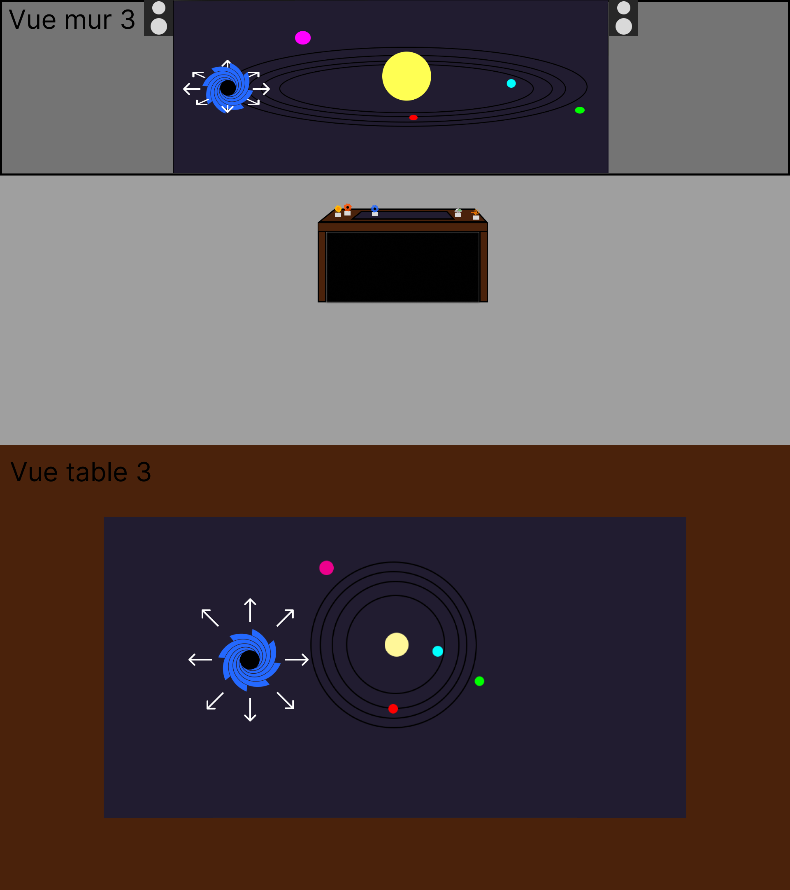
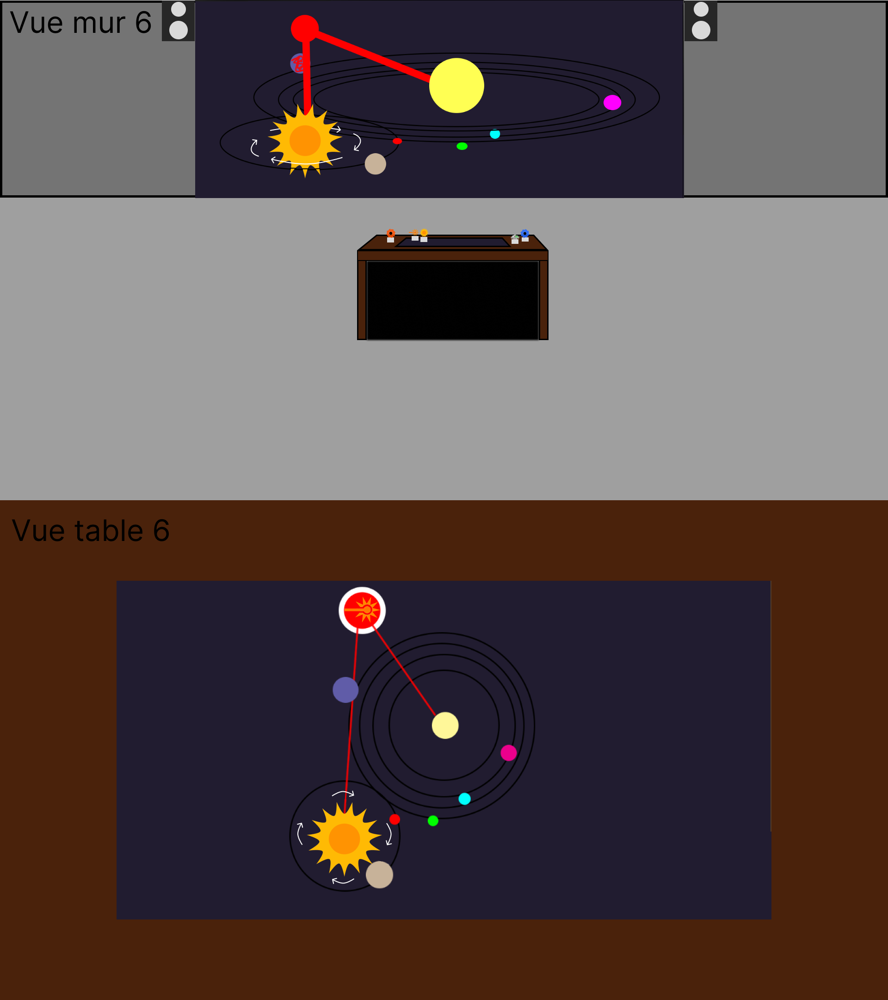
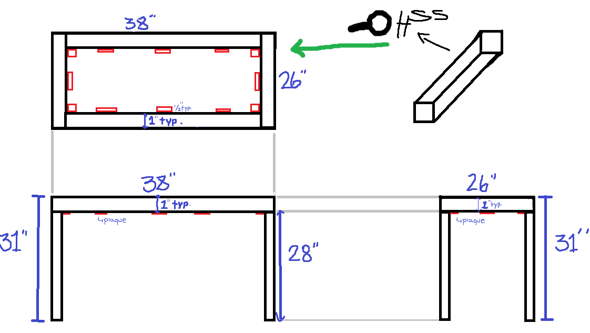
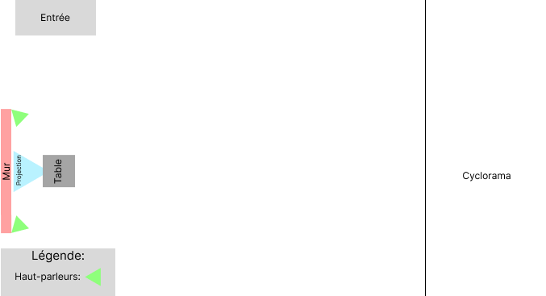

# Préproduction

# Table des matières
1. [Intention ou concept](#Intention-ou-concept)
    - [Cartographie](#Cartographie)
    - [Intention de départ](#Intention-de-départ)
    - [Synopsis](#Synopsis)
    - [Tableau d'ambiance (*moodboard*)](#Tableau-d'ambiance-(*moodboard*))
    - [Scénario, scénarimage ou document audio/visuel](#Scénario,-scénarimage-ou-document-audio/visuel)
2. [Contenu multimédia à intégrer](#Contenu-multimédia-à-intégrer)
    - [Inventaire du contenu multimédia](#Inventaire-du-contenu-multimédia)
    - [Univers artistique des éléments](#Univers-artistique-des-éléments-centraux)
3. [Planification technique d'un prototype (devis technique)](#Planification-technique-(devis-technique))
    - [Schémas ou plans techniques](#Schémas-ou-plans-techniques)
    - [Matériaux requis](#Matériaux-de-scénographie-requis)
    - [Équipements requis](#Équipements-requis)
    - [Logiciels requis](#Logiciels-requis)
    - [Ressources humaines requises](#Ressources-humaines-requises)
    - [Ressources spatiales requises (rangement et locaux)](#Ressources-spatiales-requises-(rangement-et-locaux))
    - [Contraintes techniques et potentiels problèmes de production](#Contraintes-techniques-et-potentiels-problèmes-de-production)
4. [Planification de la production d'un prototype (budget et étapes de réalisation)](#Planification-de-la-production-(budget-et-étapes-de-réalisation))
    - [Budget prévisionnel](#Budget-prévisionnel)
    - [Échéancier global](#Échéancier-global)
    - [Liste des tâches à réaliser](#Liste-des-tâches-à-réaliser)
    - [Rôles et responsabilités des membres de l'équipe](#Rôles-et-responsabilités-des-membres-de-l'équipe))
    - [Moments des rencontres d'équipe](#Moments-des-rencontres-d'équipe)

# Intention ou concept
## Cartographie

## Intention de départ
Donner le pouvoir à l'intéracteur de jouer avec un système solaire qui agit comme un bac à sable en utilisant divers outils.

## Synopsis
L'utilisateur interagit en déplaçant une statuette avec un fiducial, ceux-ci représentant les divers outils de manipulations disponible. Par exemple, on peux utiliser un trou noir pour bouger des planètes et/ou d'autres objets astronomiques et causer d'autres phénomènes astronomiques comme des éruptions solaires. Essentiellement, le système solaire est un bac à sable où on peux créer et démolir les planètes!

## Prémise du projet
L'intéracteur entre dans une salle contenant une table et quelques étranges statuettes, il aperçois sur la table un notepad, celui-ci contenant des détails sur des expériences qui ont été effectués avec la table, par le biais de ces notes, l'intéracteur apprend comment se servir de la table et il apprend également que l'individu en charge de celle-ci est présentement en pause, il ne devrait probablement pas toucher aux outils, mais il n'y a personne pour lui en empêcher...

## Tableau d'ambiance (*moodboard*)

### Description des effets des statues

## Scénario, scénarimage ou document audio/visuel

Pour accéder aux fichiers audio cliquer sur le lien: [Fichiers sonores](https://cmontmorency365.sharepoint.com/:f:/s/projetfinalgamers/EmcWks1j-_RDta-IFLM0OwABNSeXLUPmWIjgLWJMrZu5vQ?e=uDVWDE)

# Contenu multimédia à intégrer
## Inventaire du contenu multimédia

-  statuettes (pour les utilisateurs-trices)
-  sons
-  paysages sonores
-  vfx d'animation 3D
-  source lumineuse

## Univers artistique des éléments

Univers contemplatif d'éléments reliés à l'espace avec plusieurs formes et couleurs qui pourront se mélanger entre eux.

# Planification technique d'un prototype (devis technique)
## Schémas ou plans techniques

> Schéma de la table déssiné par notre soudeur

### Plantation 

### Schéma de branchement 

## Matériel de scénographie requis

* Table
    * Matériaux: Bois, acier, Acrylique, Spandex
    * 48" x 36", 30" de hauteur
* Statuettes imprimées en 3D
* Notepad contenant les infos pour l'opération de la table.

## Équipements requis

* Lumière
    * 1 Lumière DMX

* Audio
    * 2 haut-parleurs
    * 5 fils XLR 3 conducteurs de 15' (M->F)
    * 1 carte de son

* Vidéo
    * 1 projecteur vidéo shortrow
    * 1 projo ultra short-throw
    * 3 système d'acrochage
    * 1 KinectV2

* Électricité
    * 2 cordon IEC (pour l'alimentation des haut-parleurs)
    * 4 Multiprises

* Réseau
    * Switch poe 1 port
    * Switch Ethernet 3 ports
    * 7 Cables Ethernet
    * 4 Cables HDMI
    * 2 Receivers HDMI
    * 2 Sender HDMI

* Ordinateur
    * 1 ordinateur
    * 1 laptop
    

## Logiciels requis

* [Touch Designer](https://derivative.ca/)
* [Unity 2022.3.8f1](https://unity.com/)
* [Autodesk Maya](https://www.autodesk.com/ca-fr)
* [Blender](https://www.blender.org/)
* [Reaper](https://www.reaper.fm/download.php)

## Ressources humaines requises

* Guillaume Arseneault
* Thomas Ouellet Fredericks
* TTP
* Un soudeur

## Ressources spatiales requises

* Grand studio
  * Espace avec rideaux pour isoler l'oeuvre.
* Salle des matrices
  * Accès à plusieurs ports ethernet, possibilité de pouvoir avoir notre ordinateur dans cette salle. Possiblement également l'espace de rangement pour les statues de remplacement.

## Contraintes techniques et potentiels problèmes de production

| Contrainte ou problème potentiel                     | Solution envisagée                                    | Commentaires                                                                                 |
|------------------------------------------------------|-------------------------------------------------------|----------------------------------------------------------------------------------------------|
| Nous n'avons pas testé la caméra avec ReacTIVision   | Tester différentes caméras. | ReactIVision ne fait maintenant plus parti de notre projet. Nous l'avons remplacé par Touch Designer, notre projet contient maintenant du Python|
| Notre ordinateur doit pouvoir communiquer avec trop de choses en HDMI ou DisplayPort | Expérimenter des façons d'éviter d'avoir trop de choses connectées à l'ordinateur à la fois.| Problème réglé, maintenant nous n'avons qu'une seule projection|
|Nous ne pouvons pas faire la table nous-même. | Nous connaissons des soudeurs qui pourraient faire les parties métaliques pour nous.| Notre soudeur a confirmé qu'il allait pouvoir travailler sur la table a commencé à créer les plans. |

# Planification de la production d'un prototype (budget et étapes de réalisation)
## Budget prévisionnel

Matériel Requis: 

- 2 Plaques d'acrylique clair de 24"x36" avec 1/4 de pouce d'épaisseur: [Lien Vers Produit](https://www.homedepot.com/p/Falken-Design-24-in-x-36-in-x-1-4-in-Thick-Acrylic-Clear-Sheet-Falken-Design-ACRYLIC-CL-1-4-2436/308669666)
 

Prix: 103.34$

 

- Papier calque: [Lien Vers Produit](https://hachem.com/fr/rouleau-de-papier-calque-bienfang-24-x-20-verges-079946037180.html)

Prix: 15.70$

 

- Environ 40 statuettes

prix: +/- 150$

 

- Spandex: [Lien Vers Produit](https://fabricville.com/products/ima-gine-cotton-spandex-solid-black?_pos=5&_sid=7e2a5d5e5&_ss=r)

Prix: 17.49$/m

 

Total: +/- 287$ (Sans Taxes)

## Échéancier global
Étapes importantes du projet visualisé dans GitHub (*milestones*):  

*Dates importantes :*
- Remise de la vidéo d'intention: Lundi 5 Février
- Fonctionnement total de tous les logiciels entre eux : Vendredi 9 Février
- Maquette de la table terminée : Lundi 19 février
- Tout terminer les assets : Jeudi 29 Février
- Table terminée : Vendredi 9 mars
- Projet final test : Lundi 11 mars
- Présentation des projets devant public : Lundi 18 mars

## Liste des tâches à réaliser
Visualisation des tâches à réaliser dans GitHub selon la méthode kanban:  
https://github.com/orgs/Les-gars-d-la-table/projects/1/views/2

Inventaire des tâches à réaliser dans GitHub selon le répertoire d'*issues*:  
https://github.com/Les-gars-d-la-table/preproduction/issues

## Rôles et responsabilités des membres de l'équipe 

**Mikaël Tourangeau**
- Modélisation et impression 3D des statuettes.
- Coordination artistique
- Modélisation des éléments nécéssaires pour la scène Unity.

**Étienne Charron**
- Programmation des éléments présents dans la scène Unity
- Construction de la table

**Quoc Huy Do**
- S'assure du bon fonctionnement de Unity (Limit testing, troubleshooting, etc...)
- Coordination artistique
- Artiste VFX sur Unity
- Visuels de la scène sur Unity

**Jérémy Cholette**
- Création des paysages sonores
- Installation de l'équipement dans l'espace physique.

**Jacob Alarie-Brousseau**
- Coordination générale du projet (coordination de l'échéancier, du budget, suivi de la liste des tâches à réaliser, s'assurer de la répartition des rôles et des responsabilités des membres de l'équipe);
- Programmation de la détection des marqueurs sur TouchDesigner.
- Communication entre les plusieurs logiciels et appareils utilisant OSC et NDI
- Construction de la table

## Moments des rencontres d'équipe
Hebdomadaire
- **lundi "9:30"h (1h)** : Rencontre de suivi de projet.
- **Vendredi "17h" (1h)** : Rencontre du suivi de ce qu'on a réalisé pendant la semaine.

  

**Public cible : Explorateurs**

### Comportement de l’interacteur 
L’interacteur va pouvoir manipuler l’environnement grâce à des statuettes qui vont chacune causer des effets différents. Ces différents effets créeront un chaos alors que d’autre créeront un certain calme. 

 

### Esthétique 
Le visuel du projet sera centré sur le style “low-poly" et le sonore sera plus électronique et mystérieux. Le projet va ressembler un a système solaire et sera en 3D. Le style représente une simulation spatiale non-réaliste créer par des scientifiques pour simuler un système solaire et les interacteurs sont des personnes qui ne sont pas supposer toucher à rien. 

 

### Espace
L’interacteur pourra se promener librement autour de la table dans le but d’observer le système solaire projeter sur la table dans tous les angles qu’il voudra en plus de pouvoir tout déplacer ce qu’il y aura dessus. L’interacteur peut également se déplacer dans l’espace autours de la table pour explorer le laboratoire pour aller chercher les statues et en apprendre plus sur leurs effets.

 

### Temps
Les mouvements des planètes sera lent mais suffisamment rapide pour que l’interacteur ne perde pas l’intérêt de regarder les planètes bouger grâce à ses interactions sur eux. L’objectif est que l’interacteur soit suffisamment intéressé par le concept des statues pour rester et essayer des différents scénarios.

 
### Quelles émotions voulons-nous faire vivre à l’interacteur?  

L’émotion que nous voulons faire vivre est l’émerveillement car pensons que l’idée d’une action faite dans la réalité ayant un impact sur ce qu’il se passe sur la table est quelque-chose qui peut avoir beaucoup d’effet sur l’interacteur. 

### Quelles questions votre projet met-il dans l’esprit de l’interacteur? 

Les questions que les interacteurs vont se poser seront principalement sur ce que font les statuettes et ce que fait la table. 

### Que devrons-nous faire pour qu’il ait envie de répondre à ces questions? 

Nous ferons en sortes que les interacteurs puissent comprendre que les statuettes doivent être poser sur la table pour qu’il se produise quelque chose. Pour ce faire nous pourrions ajouter des effets lorsque la table est `inactive` pour que l’interacteur comprenne qu’il doit poser la statuette sur la table. 

  

Liste d’actions basiques (verbes): 
 
- Prendre
- Poser
- Glisser
 
 Objets:
 - Les statuettes
 
Liste d’actions émergentes: 
 
- Attirer les planètes 
- Repousser les planètes 
- Exploser les planètes 
- Créer une orbite
- Changer les attributs des planètes
- Créer des réactions inatendues en posant plusieurs statues sur la table.
- 

Progression de l'expérience:
 
- Ajouter plus de planètes au système solaire
- Retirer des planètes au système solaire
- Création de nouvelles planètes à partir de fragments de d'autres planètes.

Paragraphe de description de notre projet:
Vous vous retrouvez dans un laboratoire contenant une table, après un peu de recherche vous découvrez que sur l'écran au dessus de celle-ci se trouve une simulation d'un système solaire avec laquelle vous pouvez intéragir en déposant des statues déclancheant différents phénomènes. Vous êtes invité à expérimenter sur cette table, jusqu'à ce que les scientifiques reviennent du moins...
